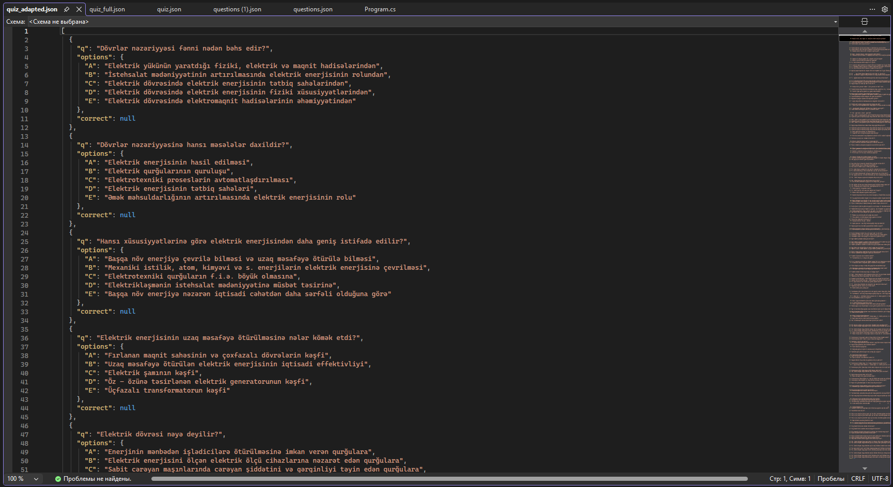

# WordQuestionsParser

Word faylından (.docx) sualları və cavab variantlarını çıxararaq JSON formatında saxlayan C# konsol tətbiqi.

## Nə edir
- Dövrlər nəzəriyyəsi fənni üzrə ~300 sualı avtomatik ayırd edir
- Sualları "?" işarəsi ilə müəyyənləşdirir
- Cavab variantlarını A/B/C... kimi avtomatik təyin edir
- Nəticəni quiz_adapted.json faylında saxlayır

## Necə istifadə etmək

Layihəni işə salmaq üçün aşağıdakı addımları izləyin. Hamısı sadə və tezdir!

### 1. Hazırlıq
- `input.docx` faylını (sualların olduğu Word sənədini) yükləyin.
- Onu kompüterinizin **C:\Temp** qovluğuna qoyun.  
  (Əgər C:\Temp qovluğu yoxdursa, özünüz yaradın: sağ klik → Yeni → Qovluq → Temp adını verin)

### 2. Konsolu açın və layihə qovluğuna keçin
1. **Win + R** düymələrini basın → `cmd` yazın → Enter.
2. Konsolda layihə qovluğuna keçin: cd C:\Users\Nihat\source\repos\WordQuestionsParser\WordQuestionsParser
   (Əgər layihə başqa yerdədirsə, yolu özünüzə uyğun dəyişdirin)

### 3. Lazım olan paketləri bərpa edin və layihəni qurun
- "dotnet restore"
- "dotnet build"

### 4. Proqramı işə salın
Proqramı işə salmaq üçün iki əsas yol var:

#### Variant 1 – Ən sadə və tövsiyə olunan (nəticə C:\Temp qovluğunda saxlanılır)
- "dotnet run -- "C:/Temp/input.docx" "C:/Temp/""

#### Variant 2 – Nəticəni C: kökündə saxlamaq istəyirsinizsə (tövsiyə olunmur, amma işləyir)
- "dotnet run -- "C:/Temp/input.docx" "C:/""

### 5. Nəticə
- Proqram işlədikdən sonra konsolda belə mesaj görəcəksiniz: Gərək! Fayl saxlanıldı: C:/Temp/quiz_adapted.json Tapılan sual sayı: ~300
- - **C:\Temp\quiz_adapted.json** faylını açın — orada bütün ~300 sual JSON formatında olacaq!

### Qeyd
- Əgər "Fayl tapılmadı" xətası alırsınızsa → input.docx faylının **C:\Temp** qovluğunda olduğundan əmin olun.
- Proqram hər dəfə işə salındıqda əvvəlki quiz_adapted.json faylını yenidən yazır.

Uğurlar! 🚀  
Hər hansı sualınız olarsa, mənə yazın.

## Nəticənin nümunəsi (quiz_adapted.json)

İlk sualların JSON formatında necə göründüyü:

(Saytdan skrinşot çəkin, `example-quiz-json.png` adı ilə saxlayın və repozitoriyaya əlavə edin)

## Quraşdırma və inkişaf
- .NET 10 SDK quraşdırılmış olmalıdır
- Layihəni klonlayın: git clone https://github.com/NIKO77FIKO/WordQuestionsParser.git
- Lazım olan paketləri bərpa edin: dotnet restore
- Tətbiqi işə salın (yuxarıdakı nümunəyə baxın)

## Gələcək planlar
- Sualların düzgün cavablarını avtomatik aşkarlamaq (bold şrift və ya başqa işarələr)
- Fərqli formatlara ixrac (CSV, Excel, Quizlet və s.)
- GUI (Windows Forms və ya WPF) əlavə etmək
- Bir neçə Word faylını toplu emal etmək

Əməkdaşlığa hazıram!  
Təklifləriniz və ya pull request-ləriniz varsa – xoş gəlmisiniz 😊

## Müəllif
- GitHub: [@NIKO77FIKO](https://github.com/NIKO77FIKO)
